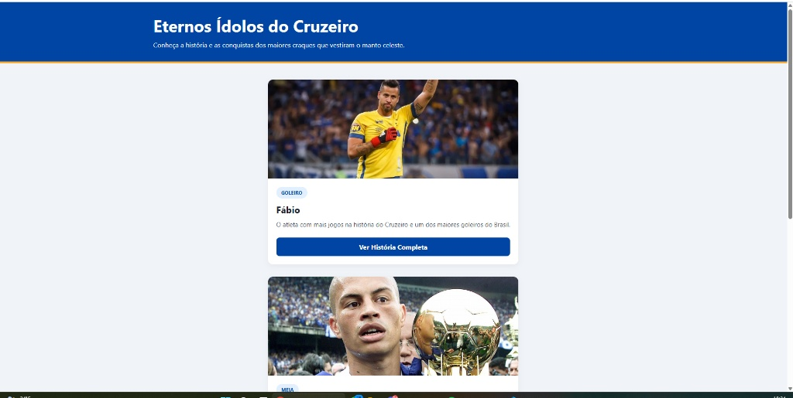
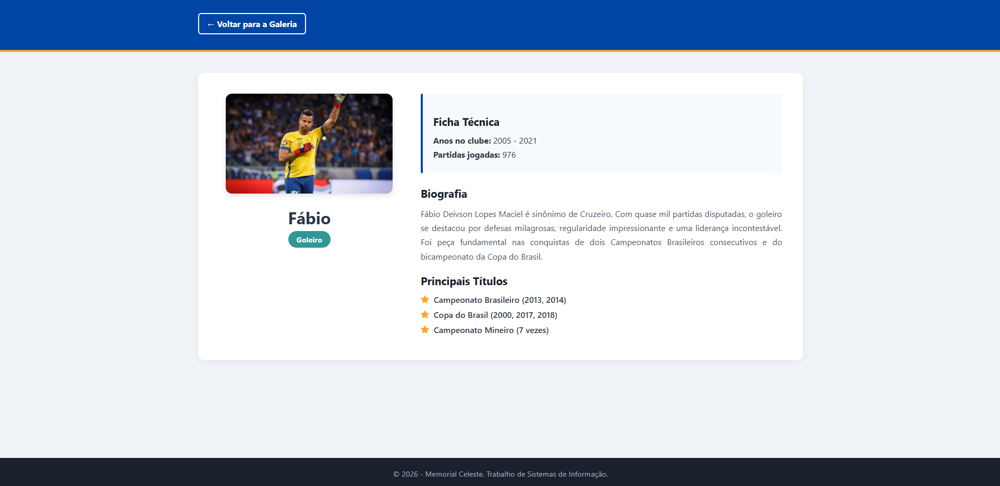

# Memorial de Ídolos do Cruzeiro Esporte Clube

Este projeto foi desenvolvido como parte das atividades de Desenvolvimento Web do curso de Sistemas de Informação. A aplicação consiste em uma plataforma dinâmica que lista grandes ídolos da história do clube e exibe informações detalhadas de cada atleta através do conceito de páginas interligadas dinamicamente.

## 👤 Dados do Aluno
* **Nome:** Lucas de Freitas Ferreira
* **Matrícula:** 1574447
* **Curso:** Sistemas de Informação
* **Período:** 1º Semestre

---

## 🛠️ Habilidades Técnicas Aplicadas
* **Manipulação do DOM com JavaScript:** Renderização dinâmica de elementos HTML na inicialização da página.
* **Componentização:** Criação de cards reutilizáveis via manipulação de nós do DOM.
* **Passagem de Parâmetros via URL:** Uso de *Query String* (`?id=X`) e a API `URLSearchParams` para criar uma página de detalhes única e dinâmica.
* **Arquitetura de Dados:** Centralização de informações estruturadas simulando um banco de dados no formato JSON.
* **Layout Responsivo:** Uso de CSS Grid e Flexbox para total adaptabilidade em dispositivos móveis.

---

## 📸 Demonstração do Sistema

### Home-Page (Galeria de Ídolos)
A página inicial carrega o array JSON e monta os cards de todos os jogadores automaticamente.


### Página de Detalhes
Ao clicar em "Ver História Completa", o usuário é direcionado para a página única de detalhes, que captura o ID da URL e renderiza a biografia, estatísticas e títulos do respectivo jogador.


---

## 💾 Estrutura de Dados JSON Utilizada (`app.js`)

O arquivo de lógica centralizada utiliza a seguinte estrutura para alimentar a aplicação:

```javascript
const dados = [
    {
        "id": 1,
        "nome": "Fábio",
        "posicao": "Goleiro",
        "periodo": "2005 - 2021",
        "jogos": "976",
        "descricao": "O atleta com mais jogos na história do Cruzeiro...",
        "biografia": "Fábio Deivson Lopes Maciel é sinônimo de Cruzeiro...",
        "titulos": ["Campeonato Brasileiro (2013, 2014)", "Copa do Brasil..."],
        "imagem": "imagens/fabio.png"
    },
    {
        "id": 2,
        "nome": "Alex",
        "posicao": "Meia",
        "periodo": "2001 - 2004",
        "jogos": "121",
        "descricao": "O 'Talento Azul', maestro da histórica Tríplice Coroa...",
        "biografia": "Alexandro de Souza, o Alex, teve uma das passagens...",
        "titulos": ["Tríplice Coroa (2003)", "Campeonato Brasileiro..."],
        "imagem": "imagens/alex.png"
    },
    {
        "id": 3,
        "nome": "Tostão",
        "posicao": "Atacante / Meia",
        "periodo": "1963 - 1972",
        "jogos": "378",
        "descricao": "O 'Rei Branco', maior artilheiro da história...",
        "biografia": "Eduardo Gonçalves de Andrade, o Tostão, é considerado...",
        "titulos": ["Taça Brasil / Campeonato Brasileiro (1966)..."],
        "imagem": "imagens/tostao.png"
    }
];