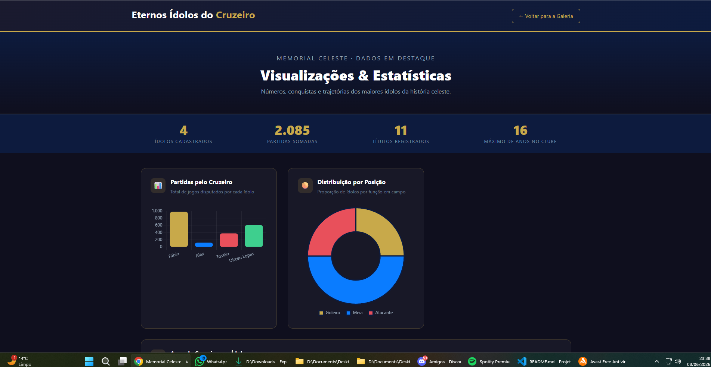
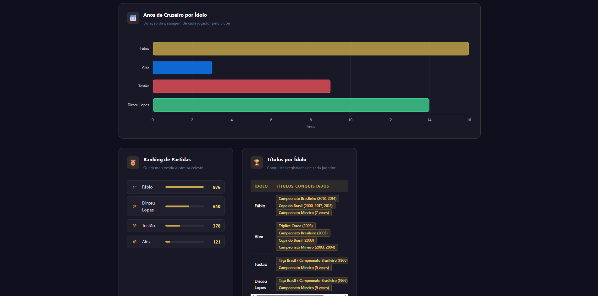

# 🏆 Memorial Celeste — Ídolos do Cruzeiro Esporte Clube

Plataforma web dinâmica desenvolvida como atividade interdisciplinar do curso de Sistemas de Informação. A aplicação lista grandes ídolos da história do Cruzeiro e exibe informações detalhadas de cada atleta por meio de páginas interligadas dinamicamente, utilizando dados estruturados em JSON e renderização assíncrona via JavaScript puro.

---

## 👤 Dados do Aluno

| Campo | Informação |
|---|---|
| **Nome** | Lucas de Freitas Ferreira |
| **Matrícula** | 1574447 |
| **Curso** | Sistemas de Informação |
| **Período** | 1º Semestre |

---

## 📄 Páginas do Projeto

| Arquivo | Descrição |
|---|---|
| `index.html` | Galeria principal com carrossel de destaques e grid de cards |
| `detalhes.html` | Página individual de cada ídolo, carregada dinamicamente via query string (`?id=X`) |
| `visualizacoes.html` | Dashboard com gráficos e estatísticas dos dados cadastrados |
| `js/app.js` | Lógica central: dados JSON, renderização do DOM e navegação |
| `css/estilo.css` | Estilos customizados do projeto |

---

## 📊 Funcionalidade de Visualizações (`visualizacoes.html`)

Página de dashboard que processa e exibe os dados dos ídolos cadastrados de forma visual e interativa, utilizando a biblioteca **Chart.js**. Os dados são lidos diretamente da estrutura JSON do `app.js` e transformados nos seguintes componentes:

- **Cards de estatísticas gerais** — total de ídolos, partidas somadas, títulos registrados e máximo de anos no clube
- **Gráfico de barras** — total de partidas disputadas por cada ídolo
- **Gráfico de rosca (doughnut)** — distribuição dos ídolos por posição em campo
- **Gráfico de barras horizontais** — duração da passagem de cada jogador pelo clube (em anos)
- **Ranking de partidas** — lista ordenada com barra de progresso proporcional
- **Tabela de títulos** — conquistas registradas de cada ídolo com badges visuais
- **Gráfico de barras douradas** — quantidade de títulos por ídolo

---

## 🖼️ Prints da Funcionalidade

### Print 1 — Hero, estatísticas gerais e primeiros gráficos


> Exibe os 4 cards de estatísticas (ídolos, partidas, títulos e anos), o gráfico de barras com as partidas por ídolo e o gráfico de rosca com a distribuição por posição.

---

### Print 2 — Gráfico de anos, ranking e tabela de títulos


> Exibe o gráfico de barras horizontais com os anos de clube, o ranking de partidas com barras de progresso e a tabela completa de títulos conquistados por cada ídolo.

---

## 🛠️ Habilidades Técnicas Aplicadas

- **Manipulação avançada do DOM com JavaScript** — renderização e injeção dinâmica de elementos HTML a partir de dados estruturados
- **Componentização com Bootstrap 5** — carrossel de destaques e sistema de grid responsivo
- **Passagem de parâmetros via URL** — uso de query string (`?id=X`) com a API `URLSearchParams` para páginas de detalhe dinâmicas
- **Modelagem de entidades relacionadas em JSON** — estrutura simulando banco relacional com entidade principal e galeria de fotos vinculada
- **Visualização de dados com Chart.js** — gráficos de barras, rosca e barras horizontais gerados a partir dos dados cadastrados
- **Layout totalmente responsivo** — grid Bootstrap combinado com CSS Flexbox customizado

---

## 💾 Estrutura de Dados JSON (`app.js`)

```javascript
const dados = [
    {
        "id": 1,
        "nome": "Fábio",
        "posicao": "Goleiro",
        "periodo": "2005 - 2021",
        "jogos": "976",
        "descricao": "O atleta com mais jogos na história do Cruzeiro...",
        "biografia": "Fábio Deivson Lopes Maciel é sinônimo de Cruzeiro...",
        "titulos": ["Campeonato Brasileiro (2013, 2014)", "Copa do Brasil..."],
        "imagem": "imagens/fabio.png",
        "destaque": true,
        "fotosVinculadas": [
            { "url": "imagens/fabio.png", "titulo": "Fábio comemorando o título..." }
        ]
    },
    // ... demais ídolos
];
```

---

## 🚀 Como executar

1. Clone o repositório
2. Abra o `index.html` em um navegador (ou use o Live Server do VS Code)
3. Navegue pela galeria, clique em um ídolo para ver os detalhes, ou acesse **Visualizações** para ver o dashboard

---

*&copy; 2026 — Memorial Celeste. Trabalho de Sistemas de Informação — PUC Minas.*
